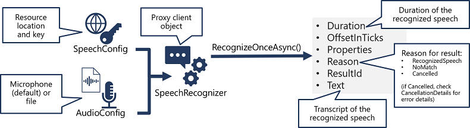
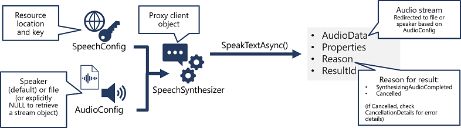

# 10. Create speech-enabled apps w the Speech service

[SpeechSynthesisOutputFormat Enum (Microsoft.CognitiveServices.Speech) - Azure for .NET Developers](https://learn.microsoft.com/en-us/dotnet/api/microsoft.cognitiveservices.speech.speechsynthesisoutputformat)

The Speech service supports:

- speech-to-text: enables speech recognition where ur app can accept spoken input
- text-to-speech: enables speech synthesis where ur app can provide spoken output
- speech translation: translate spoken input into mult langs
- speaker recognition: enables ur app to recognize individual speakers based on their voice
- intent recognition: integrates w Language Understanding service to determine semantic meaning of spoken input

## Use the Speech to text API

Speech service supports speech recognition through 2 REST APIs:

- the speech-to-text API: primary way to perform speech recognition
- the speech-to-text short audio API: optimized for short streams of audio (60s)

In practice, most interactive speech-enabled apps use the Speech service through a prog lang specific SDK. 

## Use the Speech SDK



Patern to use the Speech to text API: 

1. Use a **SpeechConfig** object to encapsulate the info required to connect to your speech resource (location and key)
2. Optionally, use **AudoConfig** to define input source for audio. By default, its system microphone but you can specify an audio file. 
3. Use **SpeechConfig** and **AudioConfig** to create a **SpeechRecognizer** object, this object is proxy client for the api. 
4. Use methods of **SpeechRecognizer** object to call underlying API functions, such as **RecognizeOnceAsync**() using Speech service to asynchronously transcribe a single spoken utterance. 
5. Process the response from the Speech service. In the case of **RecognizeOnceAsync**(), the result is a **SpeechRecognitionResult** object that includes:
    - Duration
    - OffsetInTicks
    - Properties
    - Reason
    - ResultId
    - Text

If operation was successful, **Reason** property enumerated value **RecognizedSpeech** and **Text** property contains the transcription. Other possible values for **Result** include **NoMatch** or **Canceled**. 

## Use the text to speech API

Similar to speech recognition:



## Configure audio format and voices

When synthesizing speech, you can use SpeechConfig object to customize the audio returned by the Speech service. 

### Audio format

Speech service supports mult output formats, you can choose one based on audio file type, sample-rate or bit-depth. To specify required output format as an ex:

```bash
speechConfig.SetSpeechSynthesisOutputFormat(SpeechSynthesisOutputFormat.Riff24Khz16BitMonoPcm);
```

### Voices

Two kinds of voice: standard (syntehtic voice from audio samples) and neural (natural sounding voice created using deep neural networks). 

Voices are identified by names that indicate locale and person’s name: en-GB-George

```bash
speechConfig.SpeechSynthesisVoiceName = "en-GB-George";
```

## Use Speech Synthesis Markup Language

While SpeedSDK enables you to submit plain text to be synthesized into speech, the service also supports an XML-based syntax for describing characteristics of the speech. The Speech Synethesis Markup Language (SSML) syntax offers greater control over how the spoken output sounds, enabling you to:

- Specify speaking style (”excited”)
- Insert pauses or silence
- Specify phonemes (”SQL”→”Sequel”)
- Adjust prosody of the voice (affecting the pitch, timbre, and speaking rate)
- Use common “say-as” rules (date time, phone #)
- Insert recorded speech/audio (background noise simulator)

Consider the following SSML:

```bash
<speak version="1.0" xmlns="http://www.w3.org/2001/10/synthesis" 
                     xmlns:mstts="https://www.w3.org/2001/mstts" xml:lang="en-US"> 
    <voice name="en-US-AriaNeural"> 
        <mstts:express-as style="cheerful"> 
          I say tomato 
        </mstts:express-as> 
    </voice> 
    <voice name="en-US-GuyNeural"> 
        I say <phoneme alphabet="sapi" ph="t ao m ae t ow"> tomato </phoneme>. 
        <break strength="weak"/>Lets call the whole thing off! 
    </voice> 
</speak>
```

It specifies a spoken dialog btw 2 different neural voices like:

- Ariana (cheerfully): “I say tomato”
- Guy: “I say tomato (pronounced tom-ah-toe) … Let’s call the whole thing off!”

To submit description, use:

```bash
speechSynthesizer.SpeakSsmlAsync(ssml_string);
```

## Knowledge check:

**1. What information do you need from your Speech service Azure resource to consume it using the Speech SDK?**

- The location and one of the keys
- The primary and secondary keys
- The endpoint and one of the keys

**2. Which object should you use to specify that the speech input to be transcribed to text is in an audio file?**

- SpeechConfig
- AudioConfig
- SpeechRecognizer

**3. How can you change the voice used in speech synthesis?**

- Specify a SpeechSynthesisOutputFormat enumeration in the SpeechConfig object.
- Set the SpeechSynthesisVoiceName property of the SpeechConfig object to the desired voice name.
- Specify a filename in the AudioConfig object.
