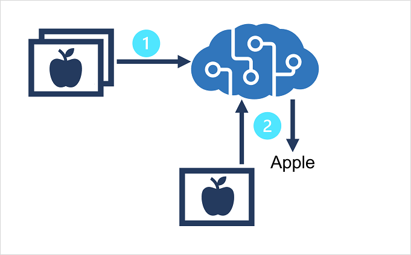

# 17. Classify images

## Provision Azure resources for custom vision

- Custom Vision enables you to build ur own computer vision models for image classification or object detectin
- Creating custom vision solution has two steps:
    1. Use labeled images to train Custom Vision model
    2. Create a client app that submits new images to your model to generate predictions

To use Custom Vision service, provision 2 kinds of Azure resource:

- A training resource (Cognitive Services or Custom Vision(Training) resource)
- A prediction resource (Cognitive Services of Custom Vision(Prediction) resource)

Models can be trained for multiclass classification (mult classes, each image belongs to 1 class) or multilabel classification (img associated w mult labels)

## Train an image classifier

Use the Custom Vision portal, the Custom Vision REST API or SDK, or a combination to train an image classification model. 

Portal has a GUI you can use to:

1. Create an image classification project for your model and associate it with a training resource
2. Upload imgs, assign class label tags to them
3. Review and edit tagged imgs
4. Train and evaluate a classification model
5. Test a trained model
6. Publish a trained model to a prediction resource

REST API and SDKs enable you to perform same tasks by writing code, which is useful if you want to automate model training and publishing as part of a DevOps process. 

## Knowledge check

1. **You want to train a model that can categorize an image as "cat" or "dog" based on its subject. What kind of Custom Vision project should you create?**
    1. Image classification (multiclass)
    2. Image classification (multilabel)
    3. Object detection
2. **You want to train a model that can categorize an image as "cat" or "dog" based on its subject. What kind of Custom Vision project should you create?**
    1. Custom Vision (Training)
    2. Computer Vision
    3. Cognitive Services