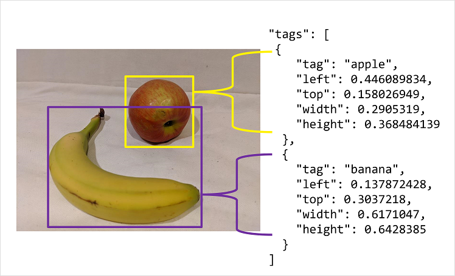

# 18. Detect objects in images

## Understand object detection

Detect the presence and lcoation of 1 or more classes of object in an image. Two components to object detection prediction:

- Class label of each object detected in the image. Ex: you might ascertain that an image contains 1 apple and 2 oranges
- Location of each object within the image, coordinates of a bounding box that encloses the object

## Use Custom Vision service for object detection

To use Custom VIsion service, provision 2 kinds of Azure resource

- Training (Cog Services or Custom Vision (Training))
- Prediction (Cog Services or Custom Vision (Prediction))

## Train an object detector

- Use the Custom Vision portal to upload and label img before training, evaluating, testing and publishing the model (Or use REST API/SDK to write code to train them)
- Image classification requires one or more tags that apply to the whole image, object detection requires each label to have a tag and a region that defines the bounding box for each object in an image.

## Consider options for labeling images

You can use the interactive interface in Custom Vision protal. Or, after tagging initial batch of images, you can train the model. Subsequent labeling of new images can benefit from the smart labeler tool inthe portal. You can also use a labeling tool provided in Azure ML Studio or Microsoft Visual Object Tagging Tool. 

### Bounding box measurement units

- You may need to adjust output to match measurement units expected by Custom Vision API.
- Bounding boxes are defined by 4 values that represent left (X) and top (Y) coordinates of the top-left corner of the bounding box, and the width and height.
    - The values are proportional relative to src img size. Ex:
        - L = 0.1, T = 0.5, W = 0.5, H = 0.25
        - Box one tenth from left edge of the image and top is half the image height from the top. Box is half the width and quarter of the height of overall img

## Knowledge check

**1. What does an object detection model predict?**

- The location and class of specific classes of object in an image.
- The class of the main subject of an image.
- The file type of an image.

**2. What must you do before taking advantage of the smart labeler tool when creating an object detection model?**

- Create a JSON file containing bounding box coordinates.
- Tag some images with objects of each class and train an initial object detection model.
- Train an image classification (multilabel) model.