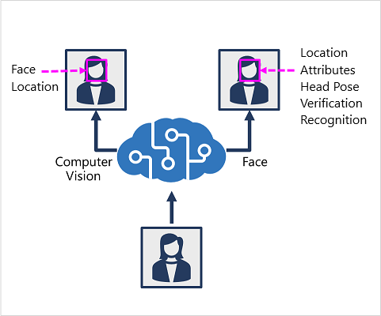

# 19. Detect, analyze, and recognize faces

## Identify options for face detection analysis and identification

Two cognitive services you can use to build solutions that detect faces in images. 

### Comp Vision service

- Enables detecting human faces in an img and returns a bounding box for its location

### Face service

- Face detection (w bounding box)
- Comprehensive facial feature analysis (including head pose, presence of spectacles, blur, facial landmarks, occlusion and others)
- Face comparison and verification
- Facial recognition

## Detect faces w Computer Vision service

To detect and analyze faces w Computer Vision service, call the **Analyze Image** REST function, specifying **Faces** as one of the visual features to be returned

## Understand capabilities of the face service

You can use it for:

- Face detection: includes and ID for each face and bounding box coordinates
- Face attribute analysis: wide range of facial attributes like
    - Head pose (pitch, roll, yaw in 3D space)
    - Glasses (NoGlasses, ReadingGlasses, Sunglasses, Swimming Goggles)
    - Blur (low, med, high)
    - Exposure (underExposure, goodExposure, overExposure)
    - Noise
    - Occlusion
- Facial landmark location: eye corners, pupils, tip of nose and etc.
- Face comparision: compare faces across mult images for similarity and verification
- Facial recognition

## Compare and match detected faces

When a face is detected by the Face service, an ID is assigned to it and retained in the service resouce for 24 hrs. ID is a GUID, w no indication of identity. 

While detected face ID cashed, subsequent imgs can be used to compare new faces to the cached identity and determine if they are similar to verify. 

## Implement facial recognition

To train a facial recognition model w the Face service:

1. Create a **Person Group** that defines the set of individuals you want to identify
2. Add a **Person** to the **Person Group** for each individual you want to identify
3. Add detected faces from mult images to each person, preferable in various poses. The IDs of these faces won’t expire after 24 hrs ⇒ now they are persisted faces
4. Train the model 

## Knowledge Check

**1. Which of the following facial attributes can the Computer Vision service predict?**

- Location.
- Type of eye-glasses.
- Occlusion.

**2. You need to create a facial recognition solution to identify named employees. Which service should you use?**

- Computer Vision.
- Custom Vision.
- Face.

**3. You need to verify that the person in a photo taken at hospital reception is the same person in a photo taken at a ward entrance 10 minutes later. What should you do?**

- Create a People Group and add a person for every hospital visitor with multiple photographs to train a model.
- Verify the face in the ward photo by comparing it to the detected face ID from the reception photo.
- Compare the Age, head pose, and hair color for the faces in the reception and ward photo's.