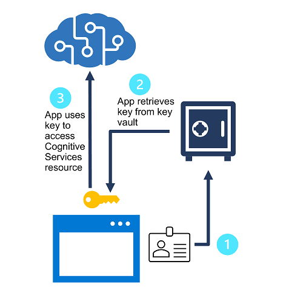

# 4. Secure Cognitive Services

Cognitive Services provides multiple layers of security that you should consider when implementing a solution.

### **Consider authentication**

Regenerate keys regularly to protect against the risk of keys being accessed by unauthorized users. 

- You can use the visual interface of Azure or use the command az cognitiveservices account keys regenerate command.
- Each cognitive service has 2 keys, so you can regenerate them without service interruption
    - Configure all prod apps to use key 2
    - Regenerate key 1
    - Switch prod to use key 1
    - Regenerate key 2

Protect keys with Azure Key Vault - an Azure service where you can securely store secrets. Access is granted to security principals (users authenticated using Azure AD). Controlling access to the secret minimizes risk of compromise by being hard-copied in an app or a config file. 

Token-Based authentication

- Subscription key is presented in an initial request to obtain an authentication token (valid period of 10 mins)
- Subsequent requests must present the token to validate authentication

The above applied to REST interface. When using an SDK, calls are handled for you by the SDK. 

Azure AD authentication is also an option in some services. 

### Implement network security

Network security ensures unauthorized users can’t reach the services that you are protecting. 

Apply network access restrictions:

- Configure some resources to restrict access to specific network addresses
- By default, it’s not restricted

### Knowledge Check

1. You need to regenerate the primary subscription key for a Cognitive Services resource that an app uses. What should you do first to minimize service interruption for the app?

- Switch the app to use the secondary key
- Change the resource endpoint
- Enable a firewall

2. You want to store the subscription keys for a Cognitive Services resource securely, so that authorized apps can retrieve them when needed. What kind of Azure resource should you provision.

- Azure Storage
- Azure Key Vault
- Azure App Service

3. When running code on your computer that connects to Cognitive Services, you receive an error that access is denied due to Virtual Network/Firewall rules. What configuration do you need to set in the Cognitive Services instance?

- In the Networking properties, configure Selected Networks and Private Endpoints.
- In Networking properties, add your client IP address to the Firewall allowed list.
- In Access control, add your Azure Active Directory user account to a role.

