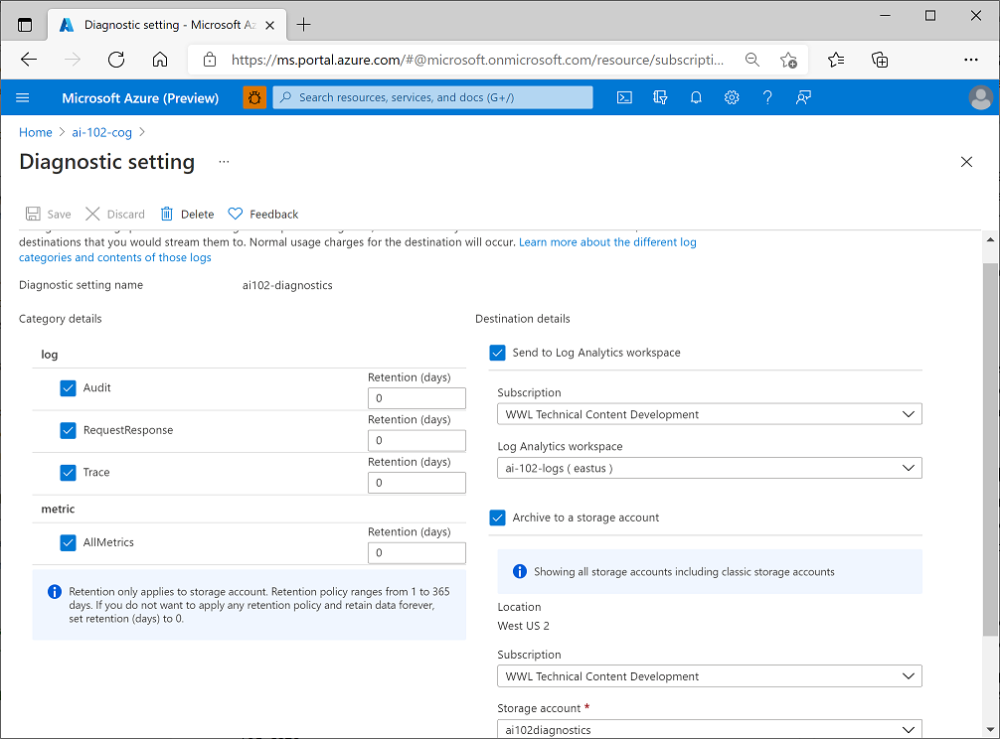
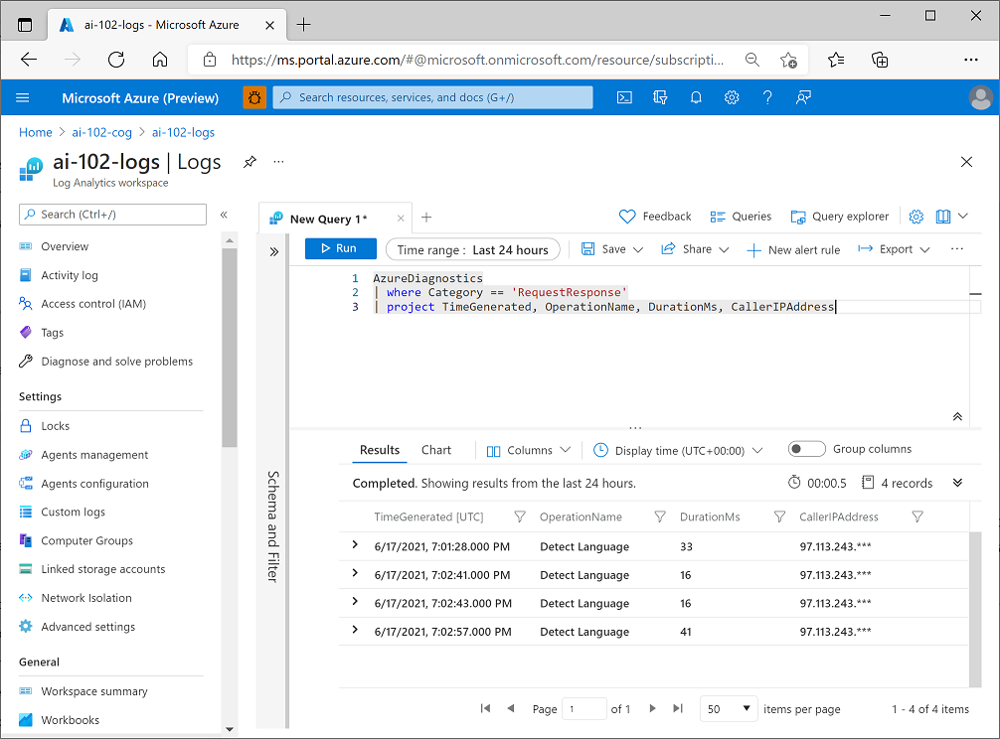

# 5. Monitor Cognitive Services

### Monitor Cost

You can estimate costs using [https://azure.microsoft.com/en-us/pricing/calculator/](https://azure.microsoft.com/en-us/pricing/calculator/) 

You can view the details of accumulated costs for Cognitive Services resources.

- Sign into Azure, select subscription and then Cost analysis tab.

### Create alerts

Azure provides alerting support for resources through alert rules

- You use them to configure notifications and alerts for your resources based on events or metric thresholds
- Alerts ensure correct teams know when problems arise

Alert rules: 

- To define the alert rule, you need to specify:
    - The scope: resource you want to monitor
    - Condition: trigger is based on signal type, which can be
        - Activity Log: entry in activity log created by action performed on the resources like regenerating subscription keys
        - Metric: metric threshold like # of errors exceeding 10 in an hour
    - Optional actions: sending an email to admin, running Azure Logic App to address issue
    - Alert rule details: name for the alert rule, resource group in which it should be defined

### View metrics

In Cognitive Services, Azure Monitor collects metrics relating to endpoint requests, data submitted and returned, errors and other useful measurements. 

Select the resouce, view the Metrics page. You can add resource-specific metrics to charts. 

You can create dashboards that consist of multiple visualizations from different resources in your Azure environment to help you gain an overall view of the health and performance of your Azure resources. To create it, select Dashboard in the Azure portal menu, add up to 100 named dashboards. 

For more info: [https://learn.microsoft.com/en-us/azure/azure-portal/azure-portal-dashboards](https://learn.microsoft.com/en-us/azure/azure-portal/azure-portal-dashboards)

### Manage diagnostic logging

Diagnostic logging enables you to capture rich operational data for Cognitive Services resource, which can be used to analyze service usage and troubleshoot problems. 

To capture diagnostic logs, you need destination for the log data. 

- You can use Azure Event Hub to forward data onto a custom telemtry solution and connect directly to 3rd party solutions
- Most cases, you’ll use either/both of the following
    - Azure Log Analytics: enables you to query and visualize log data within the Azure portal
    - Azure Storage: cloud-based data store that you can use to store log archives (can be exported for analysis in other tools as needed)

Define diagnostic settings, specifying:

- name for the settings
- categories of log event data you want to capture
- details of the destinations in which you want to store the log data

It can take 1hr+ before diagnostic data starts flowing to the dest, but when it has been captured, you can view it in Azure log Analytics by running queries as shown below:

For more info: [https://learn.microsoft.com/en-us/azure/cognitive-services/diagnostic-logging](https://learn.microsoft.com/en-us/azure/cognitive-services/diagnostic-logging)

### Knowledge Check

**1. How should you collect telemetry for your Azure Cognitive Services resource for later analysis?**

- Create an alert.
- Configure diagnostic settings.
- Create a dashboard.

**2. You are defining an alert that notifies you when a key regeneration event is recorded in the activity log for your Cognitive Services resource. What should you do?**

- Specify a Scope of Activity Log.
- Specify an Action that uses an Azure Logic App to read the activity log.
- Specify a Condition with a Signal Type of Activity Log.

**3. You are viewing a metric for your Cognitive Services resource in a chart. You want to combine the chart with visualizations of other resources and data. What should you do?**

- Add the chart to a dashboard.
- Share the chart.
- Clone the chart.