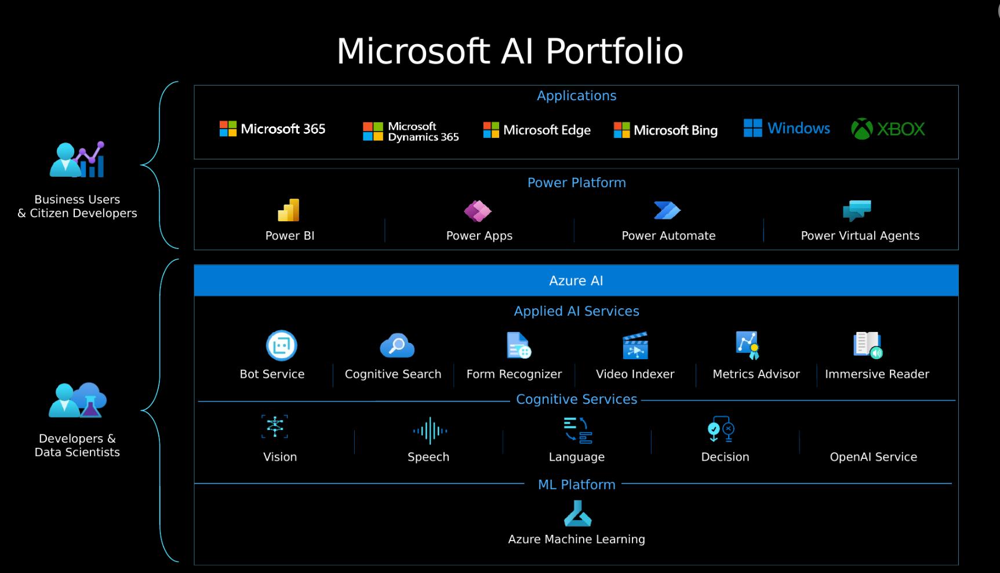

# 7. Intro to Azure OpenAI

Three of the categories of capabilities found in OpenAI AI models:

| Capability | Examples |
| --- | --- |
| Generating natural language | Such as: summarizing complex text for different reading levels, suggesting alternative wording for sentences, and much more |
| Generating code | Such as: translating code from one programming language into another, identifying and troubleshooting bugs in code, and much more |
| Generating images | Such as: generating images for publications from text descriptions and much more |

### Generative AI

- **Artificial Intelligence** imitates human behavior by relying on machines to learn and execute tasks without explicit directions on what to output.
- **Machine learning** algorithms take in data like weather conditions and fit models to the data, to make predictions like how much money a store might make in a given day.
- **Deep learning** models use layers of algorithms in the form of artificial neural networks to return results for more complex use cases. Many Azure AI services are built on DL models.
    - [difference between machine learning and deep learning.](https://learn.microsoft.com/en-us/azure/machine-learning/concept-deep-learning-vs-machine-learning)
- **Generative AI** models can produce new content based on what is described in the input. The OpenAI models are a collection of generative AI models that can produce language, code, and images.

### Describe Azure OpenAI

Azure OpenAI has four components:

- Pre-trained generative AI models
- Customization capabilities
- Built-in tools to detect and mitigate harmful use cases so users can implement AI responsibly
- Enterprise-grade security with role-based access control (RBAC) and private networks

Azure OpenAI supports many common AI workloads and solves for some new ones. Common ones includeing ML, Computer vision, NLP, conversational AI, anomaly detection, knowledge mining. Others:

- Generating natural language: text completion, embeddings (search, classify and compare text)
- Generating code: generate, edit and explain code
- Generating images: generate and edit images

Azure’s AI servises can be categorized into 3 groups: Azure ML platform, Cognitive Services, and Applied AI services

Azure AI services has 5 pillars: vision, speech, lang, decision and OpenAI service. Azure’s existing Language services can be used for widely known use-cases that require little tuning, whereas OpenAI is more customizable. 

### How to use Azure OpenAI

[https://github.com/MicrosoftLearning/AI-900-AIFundamentals/raw/main/instructions/infographics/ai900_how_auzre_api_works.pdf](https://github.com/MicrosoftLearning/AI-900-AIFundamentals/raw/main/instructions/infographics/ai900_how_auzre_api_works.pdf)

In OpenAI studio, you can build AI models and deploy them for public consumption. 

- GPT-4 model: latest generative models for natural language and code
- GPT-3.5 model: generate natural language and code based on prompts
- Embeddings: convert text to numeric vectors for analysis (comparing text for similarity)
- DALL-E: generate images based on natural language descriptions

[https://learn.microsoft.com/en-us/azure/cognitive-services/openai/how-to/fine-tuning?pivots=programming-language-studio%3Fazure-portal%3Dtrue](https://learn.microsoft.com/en-us/azure/cognitive-services/openai/how-to/fine-tuning?pivots=programming-language-studio%3Fazure-portal%3Dtrue)

You can also experiment with models in playgrounds:

- Completions: type in prompts, configure parameters, see responses w/o coding
- Chat: use assistant setup to instruct the model about how it should behave, assistant will try mimic responses including tone, rules and format you’ve defined

### Understand OpenAI’s natural language capabilities

Natural language learning models are trained on words or chunks of characters known as tokens. 

- hamburger: “ham”, “bur” and “ger”
- pear: “pear”

Tokens are mapped into vectors for an ML model to use for training. When a trained NL model takes in user input, it breaks down the input into tokens

Generative pre-trained transformer (GPT) models are excellent at understanding and creating natural language. 

### Knowledge Check

**1. How are ChatGPT, OpenAI, and Azure OpenAI related?**

- Azure OpenAI is Microsoft's version of ChatGPT, a chatbot that uses generative AI models.
- ChatGPT and OpenAI are chatbots that generate natural language, code, and images. Azure OpenAI provides access to these two chatbots.
- OpenAI is a research company that developed ChatGPT, a chatbot that uses generative AI models. Azure OpenAI provides access to many of OpenAI's AI models.

**2. You would like to summarize a paragraph of text. Which generative AI model family would you use to solve for this workload?**

- GPT.
- Codex.
- Dall-E.

**3. What is one action Microsoft takes to support ethical AI practices in Azure OpenAI?**

- Provides Transparency Notes that share how technology is built and asks users to consider its implications.
- Logs users out of Azure OpenAI Studio after a period of inactivity to ensure it's only used by one user.
- Allows users to build any application, regardless of harmful effects, to ensure fairness.