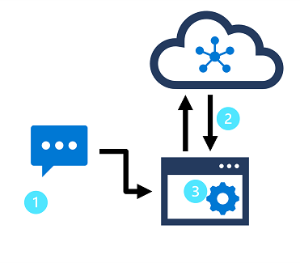

# 8. Build a language understanding model

Natural language understanding (NLU) deals w the problem of determining semantic meaning from natural lang - usually by using a trained language model. Common design pattern:


In this design pattern: 

1. An app accepts natural language input from a user
2. A language model is used to determine semantic meaning (the user’s intent)
3. The app performs appropriate action

Azure Language Understanding enables building apps based on lang models that can be trained w relatively small number of samples to discenr a user’s intended meaning. 

### Understand resources for building a language understanding model

Create Language resource in Azure to both author the model and process prediction requests from client apps. Lang resources has many features

- Some can be used w/o config: language detection or sentiment analysis
- Some require a model for prediction: conversational lang understanding and custom named entity recognition

[https://learn.microsoft.com/en-us/training/paths/build-custom-text-analytics](https://learn.microsoft.com/en-us/training/paths/build-custom-text-analytics) 

### Building your Lang Understanding model

You need to build, train and deploy the model before using it to make a prediction. Create your Language resource in Azure portal. 

One way to build the model is through REST API. Create the project, import data, train, deploy, then use the model. These tasks are done asynchronously; you need to submit request to the appropraite URI for each step, and send another request to get the status of the job. 

For each call to Lang resoruces, you authenticate the request by providing the following header:

| Key | Value |
| --- | --- |
| Ocp-Apim-Subscription-Key | The key to your resource |

### Request deployment

Submit a **POST** request to the following endpoint.

```nasm
{ENDPOINT}/language/authoring/analyze-conversations/projects/{PROJECT-NAME}/deployments/{DEPLOYMENT-NAME}?api-version={API-VERSION}
```

| Placeholder | Value | Example |
| --- | --- | --- |
| {ENDPOINT} | The endpoint of your Language resource | https://<your-subdomain>.cognitiveservices.azure.com |
| {PROJECT-NAME} | The name for your project. This value is case-sensitive | myProject |
| {DEPLOYMENT-NAME} | The name for your deployment. This value is case-sensitive | staging |
| {API-VERSION} | The version of the API you're calling | 2022-05-01 |

Include the following body with the request:

```json
{
  "trainedModelLabel": "{MODEL-NAME}",
}
```

Successfully submitting your request will receive a `202` response, with a response header of `location`. This header will have a URL with which to request the status, formatted like this:

```json
{ENDPOINT}/language/authoring/analyze-conversations/projects/{PROJECT-NAME}/deployments/{DEPLOYMENT-NAME}/jobs/{JOB-ID}?api-version={API-VERSION}
```

### Get deployment status:

Submit a **GET** request to the URL from the response header above. The values will already be filled out based on the initial deployment request.

```json
{ENDPOINT}/language/authoring/analyze-conversations/projects/{PROJECT-NAME}/deployments/{DEPLOYMENT-NAME}/jobs/{JOB-ID}?api-version={API-VERSION}
```

The response body will give the deployment status details. The `status` field will have the value of *succeeded* when the deployment is complete.

- [https://learn.microsoft.com/en-us/azure/cognitive-services/language-service/conversational-language-understanding/quickstart?pivots=rest-api#create-a-clu-project](https://learn.microsoft.com/en-us/azure/cognitive-services/language-service/conversational-language-understanding/quickstart?pivots=rest-api#create-a-clu-project)

Use Language Studio for a more visual method of building, training, and deploying the model. 

To query the model for a prediction, create a POST requeest to the URL w appropriate body specified. For built in features like language detection or sentiment analysis, you’ll query the analyze-text endpoint. 

```json
{ENDPOINT}/language/:analyze-text?api-version={API-VERSION}
```

<aside>
💡 Remember each request needs to be authenticated with your Language resource key in the `Ocp-Apim-Subscription-Key` header

</aside>

Within the body of the request, specify the kind parameter. Ex:

```json
{
    "kind": "LanguageDetection",
    "parameters": {
        "modelVersion": "latest"
    },
    "analysisInput":{
        "documents":[
            {
                "id":"1",
                "text": "This is a document written in English."
            }
        ]
    }
}
```

For more info: [https://learn.microsoft.com/en-us/azure/cognitive-services/language-service/](https://learn.microsoft.com/en-us/azure/cognitive-services/language-service/) 

### Define intents, utterances, and entities

Utterances: phrases user might enter when interacting with an app that uses ur Lang Understanding model

Intent: task/action user wants to perform (meaning of utterance)

You create a model by defining intents and associating them with one or more utterances

Intent: GetTime

Utterances: “What time is it”, “Tell me the time” …

In a lang understanding model, you define intents u want ur model to understand, so spend time considering domain your model must support and kinds of action/ifnormation users might request. 

- every model includes a None intent that u should use to explicitly ideentify utterances user might submit that requires no action or that falls outside of the scope

After that, capture various diff ex utterances for each intent. Keep these guidelines in mind when coming up with them:

- Capture mult diff examples or alt ways of saying the same thing
- Vary the length of the utterances from short, to medium to long
- Vary the location of the noun or subject of the utternace. Place it at the beginning, end or in btw.
- Use correct and incorrect grammar
- Precision, consistency and completeness of labeled data are key factors for performance
    - Label precisely: lable each entity to itts right type always, only include what u extracted, avoid unnecessary data
    - Label consistently: same entity, same label across all utterances
    - Label completely: label all instances of the entity in all your utterances

Entities are used to add specific context to intents. Ex, u can use TurnOnDevice intent to mult devices and use entities to define which device. 

You can split entities into few diff component types:

- Learned: flexible, should be used in most cases
    - u define learned component and associate words/phrases w it in training utterances. when training model, it learns to match elements in utterances w the entity
- List: useful when u need entity w specific set of possible values (days of the week as an ex)
    - include synonyms in alist so u can define DayOfWeek entity including values “Sunday” with “Sun” and “Monday” with “Mon” and etc.
- Prebuilt: useful for common types like numbers, datetimes and names
    - when prebuilt components are added, u’ll auto detect values like 6 or Microsoft. ⇒ [list](https://learn.microsoft.com/en-us/azure/cognitive-services/language-service/conversational-language-understanding/prebuilt-component-reference)

### Use patterns to differentiate similar utterances

In some cases, model can contain mult intents for which utterances are similar. Use pattern of utterances to disambiguate the intents while minimizing # of sample utterances. 

For ex, consider these utterances:

- "Turn on the kitchen light"
- "Is the kitchen light on?"
- "Turn off the kitchen light"

They are syntatically similar but they represent TurnOnDevice, GetDeviceStatus, TurnOffDevice. 

To correctly train, provide ex of each intent w diff formats of utterances

- **TurnOnDevice**:
    - "Turn the {DeviceName} on"
    - "Switch the {DeviceName} on"
    - "Turn on the {DeviceName}"
- **GetDeviceStatus**:
    - "Is the {DeviceName} on[?]"
- **TurnOffDevice**:
    - "Turn the {DeviceName} off"
    - "Switch the {DeviceName} off"
    - "Turn off the {DeviceName}"

U can create ur own lang models by defining all intents and utterances but often u can use prebuilt components to detect common entities like #s, emails, URLS or choices. To do this, create entity, and click “Add new prebuilt”. 

Creating NLU model is iterative process w the following:

1. Train a model to learn intents and entities from sample utterances.
2. Test the model interactively or using a testing dataset with known labels
3. Deploy a trained model to a public endpoint so client apps can use it
4. Review predictions and iterate on utterances to train your model

### Knowledge Check:

1. **Your app must interpret a command such as "turn on the light" or "switch the light on". What do these phrases represent in a language model?**
    1. Intents
    2. Utterances
    3. Entities
2. **Your app must interpret a command to book a flight to a specified city, such as "Book a flight to Paris." How should you model the city element of the command?**
    1. As an intent
    2. As an utterance
    3. As an entity
3. **Your language model needs to detect an email when present in an utterance. What is the simplest way to extract that email?**
    1. Use RegEx entities
    2. Use prebuilt entity components
    3. Use Learned entity components