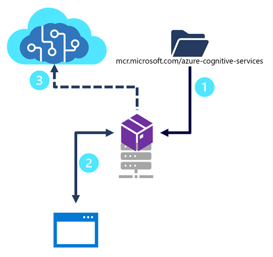

# 9. Publish and use a Language Understanding apps

## Understand capabilities of the Language service

Lang service features fall into 2 categories: 

- Pre-configured features
- Learned: require building and training model to correctly predict appropriate labels

Endpoint used to query specific feature varies, but they all are prefixed w the lang resource u created in ur Azure account. Endpoint looks something like 

```json
https://{ENDPOINT}/text/analytics/{VERSION}/{FEATURE}
```

Along w the POST query, a JSON body will be included that specifies the input documents, specifies the tasks, and provides other metadata. 

### Pre-configured features

Lang service provides certain features w/o model labeling or training:

1. **Summarization**
    1. Available for docs and converstions
    2. Summarizes text into key sentences predicted to encapsulate input meaning
    3. Summarization query is sent to an endpoint similar to the following, w task specified as “extractiveSummarizationTasks” or “ConversationalSummarizationTask” 
        
        ```csharp
        /{ENDPOINT}/text/analytics/{VERSION}/analyze
        ```
        
2. **Named entity recognition**
    1. Can extract and identify entities like people, places or companies allowing the app to recognize diff types of entities 
    2. Task will be specified as “EntityRecognition”
        
        ```csharp
        /{ENDPOINT}/language/:analyze-text?api-version={VERSION}
        ```
        
3. **Personally identifiable information (PII) detection**
    1. Allows identifying, categorizing and redacting information that can be sensitive like email/home/IP addresses, names, protected health info. 
    2. A PII query is sent to an endpoint, w the task being “PiiEntityRecognition”
        
        ```csharp
        /{ENDPOINT}/language/:analyze-text?api-version={VERSION}
        ```
        
4. **Key phrase extraction**
    1. Pulls the main concepts out of a text
    2. Key phrase extraction query sent to an endpoint w the task “KeyPhraseExtraction”
        
        ```csharp
        /{ENDPOINT}/language/:analyze-text?api-version={VERSION}
        ```
        
5. **Sentiment analysis**
    1. Identifies how positive or negative a string or document is
    2. Task specified as “SentimentAnalysis”
        
        ```csharp
        /{ENDPOINT}/language/:analyze-text?api-version={VERSION}
        ```
        
6. **Language detection**
    1. Takes one or more documents, identifies the lang for each
    2. Task: “LanguageDetection”
        
        ```csharp
        /{ENDPOINT}/language/:analyze-text?api-version={VERSION}
        ```
        

### Learned features

Require u to label data, train and deploy the model to make it available to use in your next application. These features let u customize the info that is predicted or extracted. 

1. Conversational language understanding (CLU)
    1. One of the core custom features, helps users build custom NLU models to predict overall intent and extract important information from incoming utterances
    2. Requires data to be tagged by the user to teach it how to predict intents and entities accurately 
    3. Query sent to an endpoint with the task “Conversation”, and custom features require extra parameters in the JSON body such as “projectName” and “deploymentName” of the model
        
        ```csharp
        /{ENDPOINT}/language/:analyze-conversations?api-version={VERSION}
        ```
        
2. Custom named entity recognition
    1. Takes custom labeled data and extracts specified entities from unstructured text. If u have various contract docs that you want to extract involved parties from, you can train a model to recognize how to predict them.
    2. Query task is “CustomEntityRecognition” 
3. Custom text classification
    1. Enables users to classify text or documents as custom defined groups. 
    2. Task specified as “CustomMultiLabelClassification” or “CustomSingleLabelClassification”. Requires extra parameters in JSON body like “projectName” and “deploymentName” of your model
        
        ```csharp
        /{ENDPOINT}/language/analyze-text/jobs?api-version={VERSION}
        ```
        
4. Question answering
    1. Pre-configured features that provides answers to question inputs. Data to answer comes from docs like FAQs or manuals
    2. Endpoint:
        
        ```csharp
        {ENDPOINT}/language/:query-knowledgebases?projectName={PROJECTNAME}&deploymentName={DEPLOYMENTNAME}&api-version={VERSION}
        ```
        

## Process Predictions

To consume your Lang Understanding model in a client app, you can use the REST APIs or one of the prog lang-specific SDKs. 

Requests for predictions are sent to your lang service and include: 

- **kind -** which lang feature you’re requesting
- **parameters** - values for various input parameters
- **analysis input** - specifies input docs or text strings to be analyzed by a lang service

### Prediction results

- Consist of hiearchy of info that your app must parse. When using REST, results are in JSON.
    
    ```json
    {
      "kind": "ConversationResult",
      "result": {
        "query": "What's the time in Edinburgh?",
        "prediction": {
          "topIntent": "GetTime",
          "projectKind": "Conversation",
          "intents": [
            {
              "category": "GetTime",
              "confidenceScore": 1
            },
            {
              "category": "GetDate",
              "confidenceScore": 0.1
            }
          ],
          "entities": [
            {
              "text": "Edinburgh",
              "category": "Location",
              "subcategory": "GPE",
              "offset": 19,
              "length": 9,
              "confidenceScore": 1.0
            }
          ]
        }
      }
    }
    ```
    
    Prediction results include query utterance, top intent, other potential intents with their confidence score, and entities detected. 
    
    <aside>
    💡 Language Understanding service identifies the intent of the user, it’s the responsibility of the client app to perform whatever logic is necessary to fulfill the intent
    
    </aside>
    

## Use a container

Steps to use a Language understanding app in a container:



1. Contianer image for specific Cognitive Services API you want to use is downloaded and deployed to a container host (local docker server, ACI or AKS)
2. Client apps submit data to the endpoint provided by the containerized service, and retrieve results just as they would from a Cognitive Services cloud resource in Azure 
3. Periodically, usage metrics for the containerized service are sent to a Cognitive Services resource in Azure to calculate billing for the service

Easiest way to manage deployment is to use Docker CLI. 

### Download the container image:

Use **docker** command line tool to download the container image like: 

```bash
docker pull mcr.microsoft.com/azure-cognitive-services/textanalytics/language:latest
```

### Run the container

To run it, use **docker run** command. You need **Endpoint** and **API key** parameters

```bash
docker run --rm -it -p 5000:5000 
--memory 4g 
--cpus 1 \
mcr.microsoft.com/azure-cognitive-services/textanalytics/language \
Eula=accept \
Billing={ENDPOINT} \
ApiKey={API_KEY}
```

### Query container’s service

Container provides a REST endpoint for querying at a local URL: [http://localhost:5000/](http://localhost:5000/)

## Knowledge check

1. You want to filter reviews in your app to know how many people like or dislike a business. What feature would you use?
    1. **Sentiment analysis**
    2. Key phrase extraction
    3. Entity recognition
2. You want to get only the most likely intent for your natural language query. Which parameter should you use?
    1. kind
    2. query
    3. **topIntent**